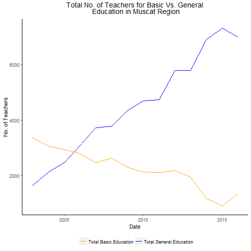

## About the Project

This Project is to create a shiny application using Rstudio. The Data is for Oman Education statistics for Basic and General Education between 2002 until 2015. It provides an easy way to get statistics for the user across regions.

To visit the application, see [Oman Education Statistics App](https://fadhila.shinyapps.io/oman_basic_vs_general_education_statistics/). 

---

## About the App  

The variables provided are;  

1. No. of Classes  
2. No. of Students  
3. No. of Schools  
4. No. of Teachers  

For each of the 11 regions, the user can select the desired output to get three graphs for;   

- Total Basic Vs General  
- Gender Based graphs segregated between Basic and General Education systems   

---

## Sample plot  
   

  

  
Here is a sample plot for Muscat Region Total No. of Teachers  for Basic & General Education;   
  
---

---
  
   
## Additional Features  

The Application also provides ratios for No. of students per teacher and class. This is an important figure to understand the load in each school and how it affects the understanding of the students.  

 
